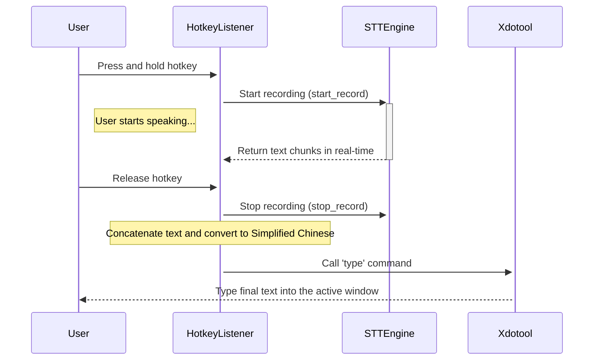

# Linux STT-Input: Real-time Speech-to-Text Input Tool

[中文版](docs/README.zh.md)

[](https://www.python.org/downloads/)
[](https://opensource.org/licenses/MIT)

A local, real-time speech-to-text (STT) input tool for Linux, powered by RealtimeSTT and Faster-Whisper. Press a hotkey to dictate directly into any application.

## Core Features

-   **Offline & Private:** All transcription is done locally. Your voice data never leaves your computer.
-   **Global Hotkey:** Use a system-wide hotkey to start and stop recording in any application.
-   **Real-time Transcription:** Powered by the `RealtimeSTT` library for fast and accurate transcription.
-   **Direct Text Input:** Uses `xdotool` to automatically type the transcribed text into the active window.
-   **Simplified Chinese Conversion:** Automatically converts recognized text to Simplified Chinese.
-   **Customizable:** Configure the hotkey, model size, and performance settings in `config.yaml`.
-   **GPU Acceleration:** Supports NVIDIA GPUs for improved performance.

## Workflow Diagram



## Installation Guide

### Step 1: Install System Dependencies

The core functionality of this tool relies on `xdotool`. Please install it first using your distribution's package manager.

-   **Debian / Ubuntu / Linux Mint:**
    ```bash
    sudo apt-get update && sudo apt-get install xdotool
    ```

-   **Fedora / CentOS / RHEL:**
    ```bash
    sudo dnf install xdotool
    ```

-   **Arch Linux / Manjaro:**
    ```bash
    sudo pacman -S xdotool
    ```

### Step 2: (Optional) Configure GPU Environment

For the best performance, using an NVIDIA GPU for acceleration is recommended. Please ensure you have correctly installed:

1.  **NVIDIA Drivers**
2.  **CUDA Toolkit**
3.  **cuDNN Library**

You can visit the [NVIDIA Developer website](https://developer.nvidia.com/) for official installation guides.

### Step 3: Clone and Install the Application

-   **Requirements:** Python 3.12 or higher.
-   **Installation Process:**
    ```bash
    git clone https://github.com/your-username/linux-stt-input.git
    cd linux-stt-input
    bash install.sh
    ```
    The `install.sh` script will automatically create a virtual environment and install all necessary Python dependencies.

## Quick Start

1.  **Launch the Application:**
    In the project's root directory, execute:
    ```bash
    bash run.sh
    ```
    You will see the message "Hotkey listener started...". The application is now running in the background.

2.  **Start Using:**
    -   Click on any window where you want to input text (e.g., a text editor, browser address bar).
    -   Press and hold the default hotkey: **`<alt>+z`**.
    -   Start speaking into your microphone.
    -   Release the hotkey when you're done.
    -   The transcribed text will automatically appear at your cursor's location.

## Configuration Details

You can easily customize the program's behavior. First, rename `config.example.yaml` to `config.yaml`. Then, edit the `config.yaml` file to suit your needs.

```yaml
# Sets the global hotkey to trigger recording.
# Supported modifiers: <alt>, <ctrl>, <shift>
# Format: "<modifier>+<key>"
hotkey: "<alt>+z"

# Delay between keystrokes in milliseconds for xdotool.
# Adjust if characters are missed during typing.
type_delay: 30

model:
  # The size of the Whisper model.
  # Options: tiny, base, small, medium, large
  # Larger models are more accurate but require more computational resources.
  size: "small"

  # Specify the language to be transcribed. Leave empty for auto-detection.
  # Format: Two-letter language code (e.g., en, zh, es, fr)
  language: "zh"

  # The data type for model computation. Significantly affects performance and memory usage.
  # - float32: Highest precision, highest resource usage (for high-end GPUs).
  # - float16: A good balance of performance and precision (recommended for modern GPUs).
  # - int8: Lowest resource usage, fastest on CPU, slightly lower precision.
  compute_type: "float16"
  
  # Specify the computation device.
  # Options: "cuda", "cpu"
  device: "cuda"
```

## How It Works

To respond to the hotkey at any time, the application runs as a persistent background process. You need to keep the `run.sh` script running to use the tool. The core components work together as follows:

1.  **[`pynput`](https://github.com/moses-palmer/pynput):** Listens for global keyboard events in the background to detect when the hotkey is pressed and released.
2.  **[`RealtimeSTT`](https://github.com/KoljaB/RealtimeSTT):** Activated when the hotkey is pressed. It captures audio from the microphone and transcribes the stream into text in real-time, leveraging the power of `Faster-Whisper`.
3.  **`zhconv`:** After the text is generated, it is converted to Simplified Chinese to ensure consistent output format for Chinese users.
4.  **`xdotool`:** When the hotkey is released, it receives the final text and simulates keyboard input to "type" it into the currently active window.

## Troubleshooting

-   **Problem: The hotkey doesn't respond.**
    -   **Solution:** Ensure no other application is using the same hotkey. Try changing the hotkey combination in `config.yaml`. Also, check if the application is still running in the background.

-   **Problem: The application fails to start or shows a "ModuleNotFoundError".**
    -   **Solution:** Make sure you have successfully run `bash install.sh`. You can run the diagnostic script to check your Python environment:
        ```bash
        uv run python diagnose.py
        ```

-   **Problem: The transcribed text is not being typed out.**
    -   **Solution:** Please confirm that you have installed `xdotool` as described in **Step 1**. You can check if it's in your system's path by typing `which xdotool` in your terminal.

## Contributing

Contributions of any kind are welcome! If you have a great idea or find a bug, please feel free to submit a Pull Request or create an Issue.

## License

This project is open-sourced under the [MIT License](https://opensource.org/licenses/MIT).