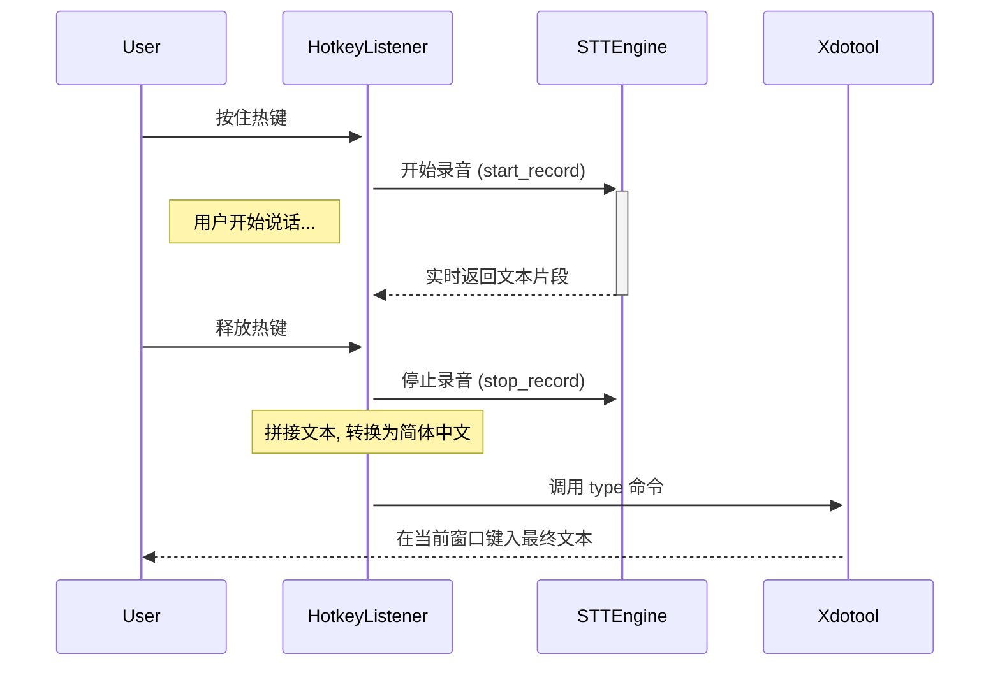

# Linux STT-Input: 实时语音到文本输入工具

[English Version](README.md)

[](https://www.python.org/downloads/)
[](https://opensource.org/licenses/MIT)

一个本地、实时的 Linux 语音转文本 (STT) 输入工具，由 RealtimeSTT 和 Faster-Whisper 驱动。按住热键，即可在任何应用程序中直接听写。

## 核心功能

-   **离线与隐私:** 所有转录任务均在本地完成，您的语音数据不会离开计算机。
-   **全局热键:** 使用一个全局热键，在任何程序中启动和停止录音。
-   **实时转录:** 由 `RealtimeSTT` 库驱动，提供快速、准确的转录。
-   **直接文本输入:** 通过 `xdotool` 将识别的文本自动键入到当前窗口。
-   **简体中文转换:** 自动将识别的文本转换为简体中文。
-   **可定制:** 可在 `config.yaml` 中配置热键、模型大小和性能参数。
-   **GPU加速:** 支持NVIDIA GPU以提升性能。

## 工作流示意图



## 安装指南

### 步骤 1: 安装系统依赖

本工具的核心功能依赖于 `xdotool`。请首先使用您的发行版包管理器安装它。

-   **Debian / Ubuntu / Linux Mint:**
    ```bash
    sudo apt-get update && sudo apt-get install xdotool
    ```

-   **Fedora / CentOS / RHEL:**
    ```bash
    sudo dnf install xdotool
    ```

-   **Arch Linux / Manjaro:**
    ```bash
    sudo pacman -S xdotool
    ```

### 步骤 2: (可选) 配置GPU环境

为了获得最佳性能，推荐使用NVIDIA GPU进行加速。请确保您已正确安装：

1.  **NVIDIA 驱动程序**
2.  **CUDA Toolkit**
3.  **cuDNN Library**

您可以访问 [NVIDIA开发者网站](https://developer.nvidia.com/) 获取官方安装指南。

### 步骤 3: 克隆并安装应用

-   **环境要求:** Python 3.12 或更高版本。
-   **安装流程:**
    ```bash
    git clone https://github.com/your-username/linux-stt-input.git
    cd linux-stt-input
    bash install.sh
    ```    `install.sh` 脚本会自动创建一个虚拟环境并安装所有必需的Python依赖。

## 快速开始

1.  **启动应用:**
    在项目根目录下，执行：
    ```bash
    bash run.sh
    ```
    您会看到提示 "Hotkey listener started..."。此时，应用已在后台运行。

2.  **开始使用:**
    -   点击任意您想输入文本的窗口（例如，文本编辑器、浏览器地址栏）。
    -   按住默认热键: **`<alt>+z`**。
    -   开始对着麦克风说话。
    -   说完后，释放热键。
    -   语音转录的文本将自动出现在您的光标位置。

## 配置详解

您可以轻松定制程序的行为。首先，将 `config.example.yaml` 文件重命名为 `config.yaml`，然后根据您的需求编辑 `config.yaml` 即可。

```yaml
# 设置全局热键以触发录音。
# 支持的修饰键: <alt>, <ctrl>, <shift>
# 格式: "<modifier>+<key>"
hotkey: "<alt>+z"

# xdotool 键入字符之间的延迟（毫秒）。
# 如果在输入过程中出现丢字现象，可以适当调高此值。
type_delay: 30

model:
  # Whisper模型的大小。
  # 可选值: tiny, base, small, medium, large
  # 越大的模型越准确，但需要更多计算资源。
  size: "small"

  # 指定要转录的语言。留空则自动检测。
  # 格式: 双字母语言代码 (例如, en, zh, es, fr)
  language: "zh"

  # 用于模型计算的数据类型。这会显著影响性能和内存使用。
  # - float32: 精度最高，资源占用最高 (适合高端GPU)。
  # - float16: 性能和精度的良好平衡 (推荐用于现代GPU)。
  # - int8: 资源占用最低，在CPU上速度最快，精度略低。
  compute_type: "float16"
  
  # 指定计算设备
  # 可选值: "cuda", "cpu"
  device: "cuda"
```

## 工作原理

为了能随时响应全局热键，本应用会作为一个常驻后台进程运行。您需要保持 `run.sh` 脚本的运行状态才能使用该工具。其核心组件协同工作流程如下：

1.  **[`pynput`](https://github.com/moses-palmer/pynput):** 在后台全局监听键盘事件，用于检测热键的按下和释放。
2.  **[`RealtimeSTT`](https://github.com/KoljaB/RealtimeSTT):** 当热键被按下时激活，调用麦克风进行录音，并利用 `Faster-Whisper` 的强大功能实时将音频流转换为文本。
3.  **`zhconv`:** 在文本生成后，将其统一转换为简体中文，以保证输出格式的一致性。
4.  **`xdotool`:** 当热键被释放时，接收最终的文本，并模拟键盘输入，将其“键入”到当前活动的窗口中。

## 故障排查

-   **问题: 按下热键没反应。**
    -   **解答:** 请确保没有其他程序占用了相同的热键。尝试在 `config.yaml` 中更换一个热键组合。同时，检查程序是否仍在后台运行。

-   **问题: 程序无法启动或报错 "ModuleNotFoundError"。**
    -   **解答:** 请确保您已成功运行 `bash install.sh`。您可以运行诊断脚本来检查Python环境是否正确：
        ```bash
        uv run python diagnose.py
        ```

-   **问题: 识别的文本没有被键入。**
    -   **解答:** 请确认您已按照 **步骤 1** 成功安装了 `xdotool`。您可以在终端输入 `which xdotool` 来检查它是否存在于您的系统路径中。

## 贡献

欢迎任何形式的贡献！如果您有好的想法或发现了Bug，请随时提交 Pull Request 或创建 Issue。

## 许可证

本项目基于 [MIT 许可证](https://opensource.org/licenses/MIT) 开源。